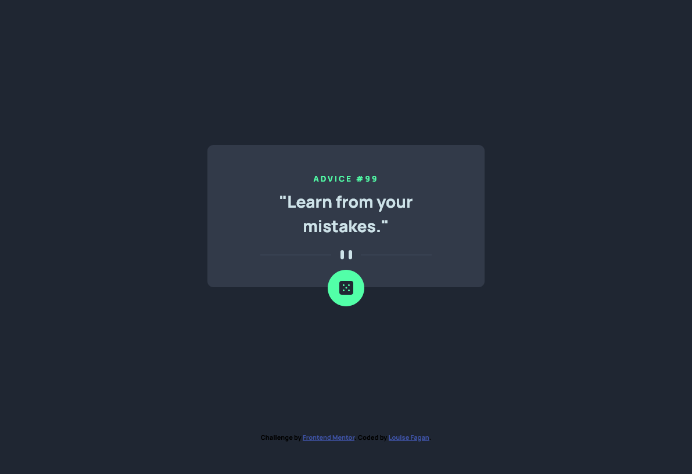

# Frontend Mentor - Advice generator app solution

This is a solution to the [Advice generator app challenge on Frontend Mentor](https://www.frontendmentor.io/challenges/advice-generator-app-QdUG-13db). Frontend Mentor challenges help you improve your coding skills by building realistic projects.

## Table of contents

- [The challenge](#the-challenge)
- [Screenshot](#screenshot)
- [Links](#links)
- [My process](#my-process)
- [Built with](#built-with)
- [What I learned](#what-i-learned)
- [Continued development](#continued-development)
- [Author](#author)

### The challenge

Users should be able to:

- View the optimal layout for the app depending on their device's screen size
- See hover states for all interactive elements on the page
- Generate a new piece of advice by clicking the dice icon

### Screenshot

### Links

- Solution URL: [GitHub Files](https://github.com/LouFagan/advice-generator.git)
- Live Site URL: [Live site](https://cheery-cendol-8cc11b.netlify.app)

## My process

Mobile development first

### Built with

- Semantic HTML5 markup
- CSS custom properties
- Flexbox
- Mobile-first workflow

### What I learned

How to hook up to an API and retrieve the data.

### Continued development

Need more javascript practice and need to learn more about how to retrieve data from APIs.

## Author

- Website - [Louise Fagan](https://www.pixelmein.ca)
- Frontend Mentor - [@LouFagan](https://www.frontendmentor.io/profile/LouFagan)
